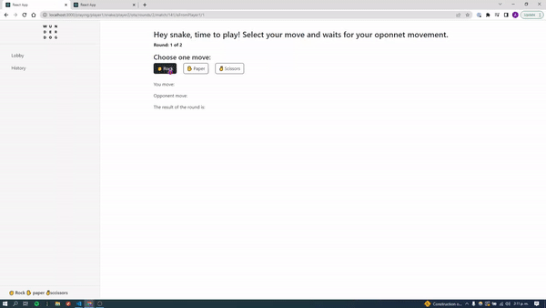

# Simple Serverless Real-Time API (WebSockets)<br/> with AWS AppSync 
### (No GraphQL knowledge required)
<br/>
This is an implementation of a simple real-time API based on WebSockets where clients are subscribed to a specific channel and any JSON data can be pushed automatically to clients listening/subscribed to the channel. Clients define the channel they're subscribed to and there can be as many channels as required. Connections, scalability, fan-out and broadcasting are all automatically handled by the API.
<br/>
<br/>

The GraphQL API is defined in code where a GraphQL schema and API definition is generated [programatically](https://docs.aws.amazon.com/cdk/api/latest/docs/aws-appsync-readme.html#code-first-schema). Client code is also automatically generated. Hand coding GraphQL schema, queries, mutations, subscriptions is not required. If there's no need to leverage the built-in GraphQL strongly typed system, this pattern allows to send any data to connected/subscribed clients as long as it's in a valid JSON format.
<br/>
<br/>

## Requirements

* [Create an AWS account](https://portal.aws.amazon.com/gp/aws/developer/registration/index.html) if you do not already have one and log in. The IAM user that you use must have sufficient permissions to make necessary AWS service calls and manage AWS resources.
* [Git installed](https://git-scm.com/book/en/v2/Getting-Started-Installing-Git)
* [Node and NPM](https://nodejs.org/en/download/) installed
* [AWS Cloud Development Kit](https://docs.aws.amazon.com/cdk/latest/guide/cli.html) (AWS CDK) installed
* [Amplify CLI](https://docs.amplify.aws/cli/start/install/), only required to generate code as the backend deployment is done via AWS CDK
<br/>
<br/>

## Deploy the API to the cloud

1. Clone the project to your local working directory:

   ```sh
   git clone https://github.com/awsed/rock-paper-scissors
   ```

2. Change the working directory to:

   ```sh
   cd rock-paper-scissors/cdk
   ```

3. Install the project dependencies:

   ```sh
   npm install
   ```

4. Deploy the stack to your default AWS account and region. After deployment, the output of this command shows the GraphQL API endpoint, API ID, and API key. Take note of all the details as they'll be needed to setup the client:

   ```sh
   cdk deploy
   ```
<br/>
<br/> 

## Configure the React.js client

1. Change the working directory to the `client` folder:

   ```sh
   cd ../client
   ```

2. Install the project dependencies:

   ```sh
   npm install
   ```
3. Create the `.env` file at the same level as `package.json`:

```sh
touch rock-paper-scissors/client/.env
```
1. Open the file `.env.sample` copy and paste its content into [.env file](https://github.com/lacruzanthony/rock-paper-scissors/blob/main/client/src/components/Lobby/Lobby.js#16) based on the output of the previous `cdk deploy`. Remember to add the REACT_APP_ prefix to each variable.

2. Generate the necessary code to interact with the API using the [Amplify CodeGen](https://docs.amplify.aws/cli/graphql-transformer/codegen/) with the API ID output of the previous `cdk deploy`. There's no need to create an Amplify CLI project, however you'll need to download the API schema from the [AWS Appsync Console](https://console.aws.amazon.com/appsync/home). Select the API `WS-API` in your account and, in the Schema section, select **Export schema**. Download and copy the schema file to the root of the `/client` folder, where you need to execute the following command accepting all defaults:

   ```sh
   amplify add codegen --apiId xxxxxxxxxxxxxxxxxxxxxx
   ```

3. Execute the application and access it from multiple browser tabs/windows at http://localhost:3000 :

    ```bash
    npm start
    ```

4. Follow the instructions from the game!. 
<br/>
<br/>



